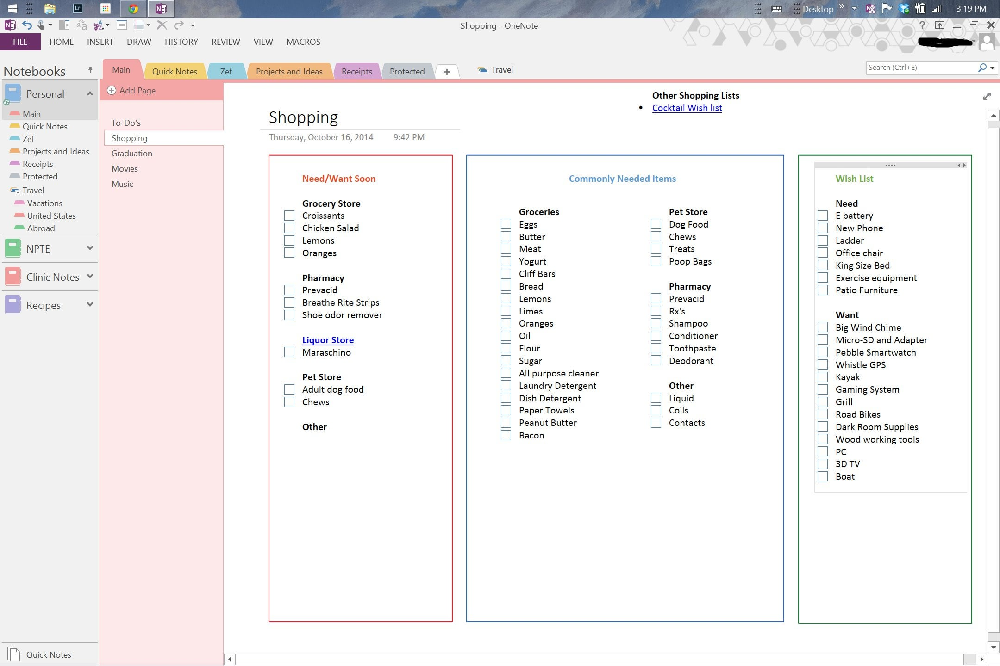
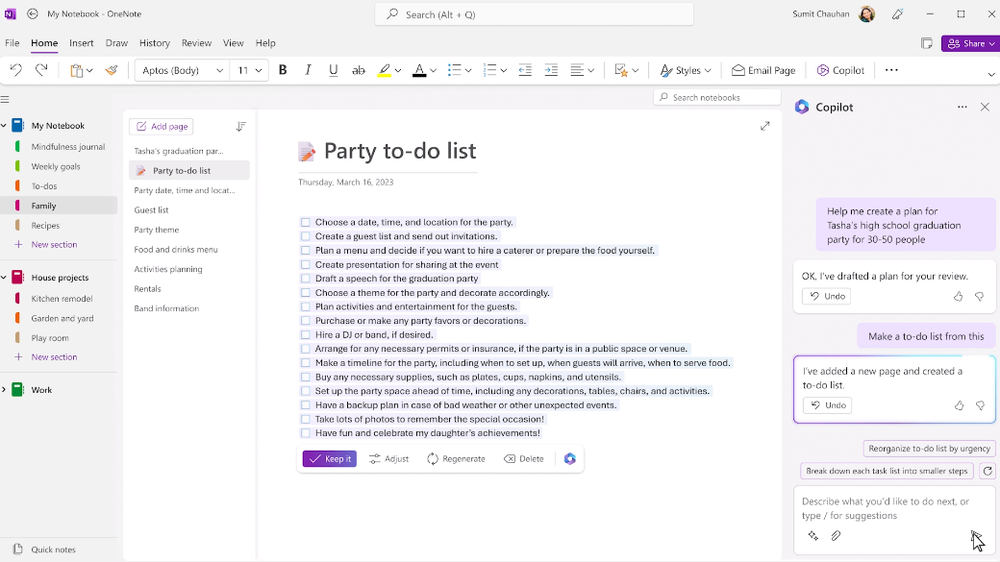

# Competitor Analysis: Microsoft OneNote
## General Information 
- **Name of System:** Microsoft OneNote
- **Company/Developer:** Microsoft
- **Website/Product Page:** <https://www.onenote.com>
- **Version/Release Date:** 2025-03-05: 2502 (Build 18526.20144)
- **Platform(s) Supported:** Web, desktop, mobile (android and iOS) 
- **Target Audience:** Microsoft Office users

--- 
## Core Functionality 

**Primary Purpose:** Note taking in a note book like hierarchy (Notebook has Sections)

**Key Features:** - Collaborative editing - Pen writing and drawing - Integration with Microsoft's services

**Unique Selling Points (USPs):** - Integration with other Microsoft's services, including Office

**Limitations/Weaknesses:** - Only integrates well with Microsoft's services

---

## Screenshots

## Online Reviews
