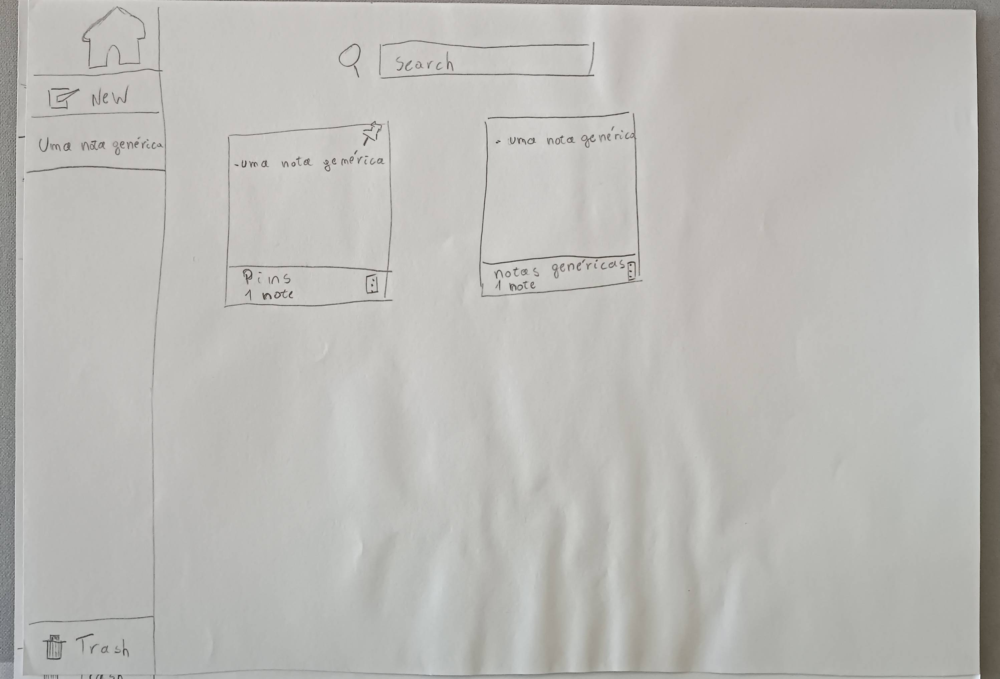
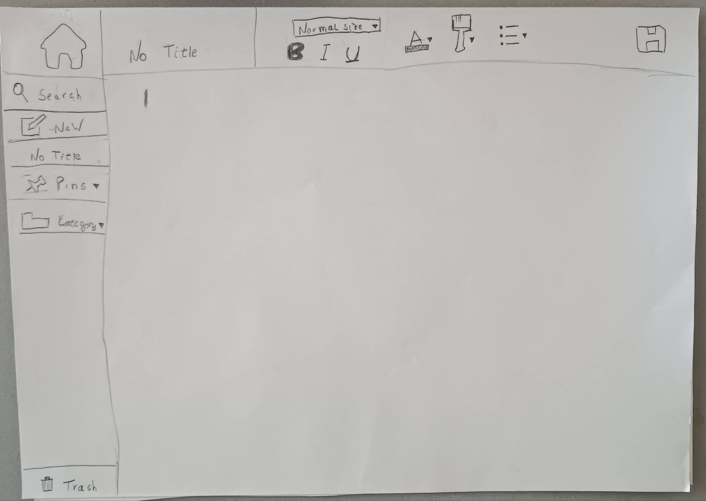
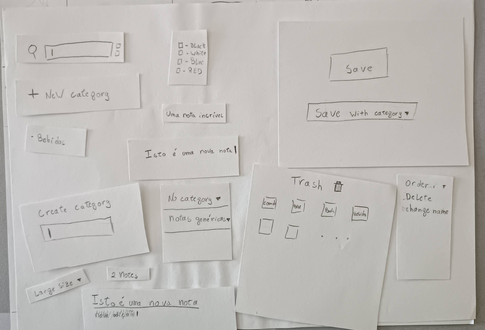
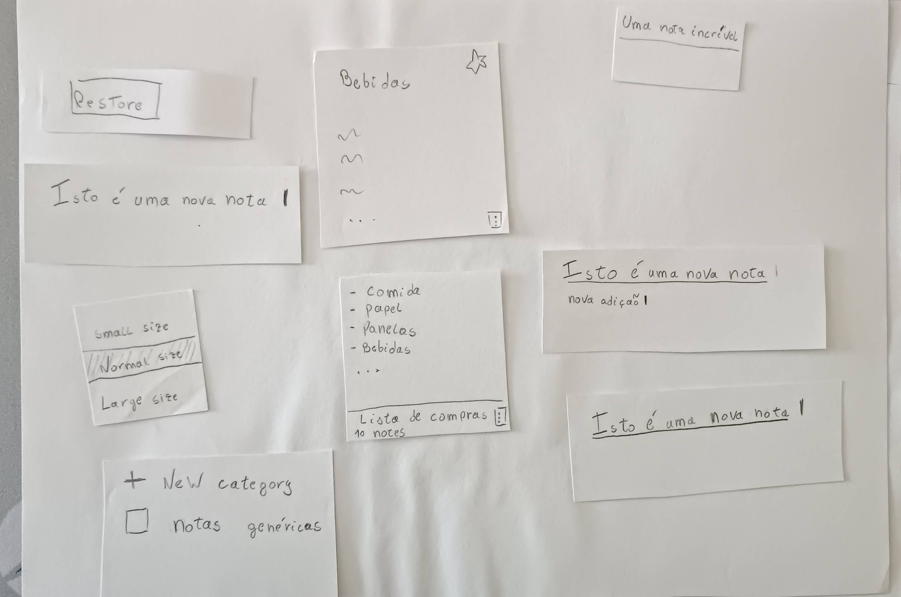

[Back to main Logbook Page](../hci_logbook.md)

---
# Low Fidelity Prototype and Evaluation

## D.1. Low Fidelity Prototype

The low fidelity prototype was made in paper.

---

## D.2. Prototype Evaluation

When tested with users, a team member coordinated the experience, while another
team member annotated the feedback the user gave during and after the test.

The users were given the following tasks:

1. Create and write a new note with a title ("An amazing note") and add the text
   ("This is a new note"), change the text size (large) and underline it. Save
   the note in a new category, named "generic notes".
2. Open a note from the ("generic notes") category and add the text ("new
   addition") with the blue highlight.
3. Delete the ("generic notes") category, and restore the note titled ("An
   amazing note") and pin that note.

---
[Back to main Logbook Page](../hci_logbook.md)

---
